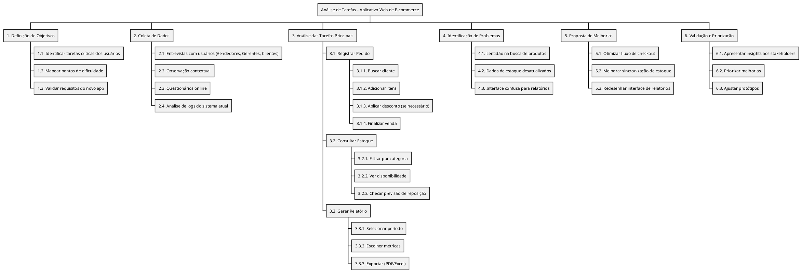
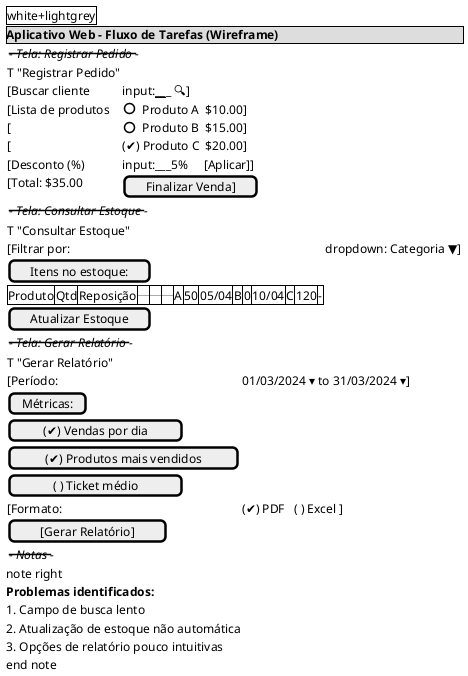
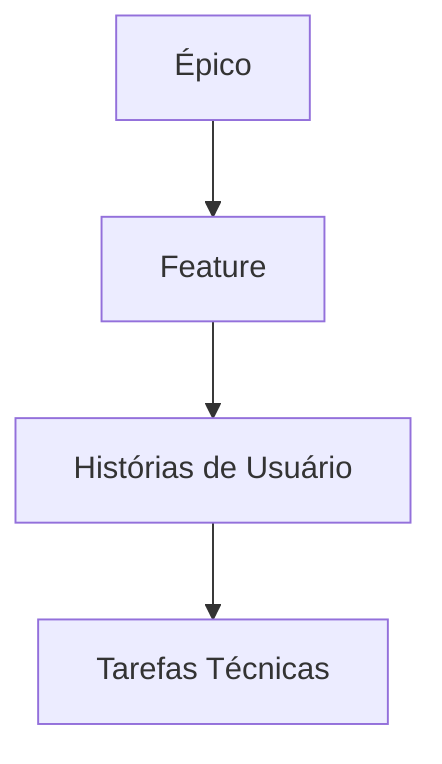

# 06 - **Análise de Tarefas**  

**Contexto:**  

Uma empresa de e-commerce está desenvolvendo um **novo aplicativo web** para facilitar a gestão de pedidos, estoque e atendimento ao cliente. A equipe de UX/UI precisa realizar uma **análise de tarefas** para entender como os usuários (vendedores, gerentes e clientes) interagem com o sistema atual e identificar oportunidades de melhoria.  

---

## **1. Objetivo da Análise de Tarefas**

- Mapear as principais tarefas realizadas pelos usuários no sistema atual.  
- Identificar pontos de dificuldade, redundâncias e oportunidades de otimização.  
- Validar se o novo aplicativo atenderá às necessidades dos usuários.  

---

## **2. Público-Alvo (Personas)**  

| Perfil          | Tarefas Principais                     |  
|-----------------|----------------------------------------|  
| **Vendedor**    | Registrar pedidos, consultar estoque   |  
| **Gerente**     | Aprovar descontos, gerar relatórios    |  
| **Cliente**     | Acompanhar pedido, solicitar suporte   |  

---

## **3. Métodos de Coleta de Dados**  

- **Entrevistas com usuários:** Perguntar sobre fluxos de trabalho e desafios.  
- **Observação contextual:** Acompanhar usuários em seu ambiente real.  
- **Questionários online:** Coletar feedback quantitativo.  
- **Análise de logs:** Verificar padrões de uso no sistema atual.  

---

## **4. Principais Tarefas a Serem Analisadas**  

| Tarefa                  | Passos Identificados                     | Possíveis Problemas              |  
|-------------------------|------------------------------------------|----------------------------------|  
| **Registrar pedido**    | 1. Buscar cliente → 2. Adicionar itens → 3. Aplicar desconto (se necessário) → 4. Finalizar venda | Lentidão na busca de produtos |  
| **Consultar estoque**   | 1. Filtrar por categoria → 2. Ver disponibilidade → 3. Checar previsão de reposição | Dados desatualizados |  
| **Gerar relatório**     | 1. Selecionar período → 2. Escolher métricas → 3. Exportar PDF/Excel | Interface confusa |  

---

## **5. Ferramentas Utilizadas**  

- **Mapeamento de fluxo:** **Figma** ou **Miro** para diagramas.  
- **Gravação de sessões:** **Hotjar** ou **Lookback** para análise de interações.  
- **Organização de dados:** **Excel** ou **Airtable** para catalogar tarefas.  

---

## **6. Resultados Esperados**  

- **Lista de tarefas críticas** a serem otimizadas no novo app.  
- **Protótipo de fluxos** aprimorados (ex.: checkout em menos etapas).  
- **Relatório de insights** com recomendações para a equipe de desenvolvimento.  

---

## **7. Próximos Passos**  

1. Validar os resultados com stakeholders.  
2. Priorizar melhorias com base na análise.  
3. Aplicar mudanças no design do novo aplicativo.  

---

**Conclusão:**  
A análise de tarefas ajudará a garantir que o novo aplicativo web seja **intuitivo, eficiente e alinhado** com as necessidades reais dos usuários.  

---

Aqui está um diagrama **WBS (Work Breakdown Structure)** em **PlantUML** para representar as tarefas da análise de tarefas do aplicativo web:


```plantuml
@startwbs
skinparam monochrome true
skinparam shadowing false
skinparam ArrowColor #000000
skinparam BackgroundColor #FFFFFF

* Análise de Tarefas - Aplicativo Web de E-commerce
** 1. Definição de Objetivos
*** 1.1. Identificar tarefas críticas dos usuários
*** 1.2. Mapear pontos de dificuldade
*** 1.3. Validar requisitos do novo app
** 2. Coleta de Dados
*** 2.1. Entrevistas com usuários (Vendedores, Gerentes, Clientes)
*** 2.2. Observação contextual
*** 2.3. Questionários online
*** 2.4. Análise de logs do sistema atual
** 3. Análise das Tarefas Principais
*** 3.1. Registrar Pedido
**** 3.1.1. Buscar cliente
**** 3.1.2. Adicionar itens
**** 3.1.3. Aplicar desconto (se necessário)
**** 3.1.4. Finalizar venda
*** 3.2. Consultar Estoque
**** 3.2.1. Filtrar por categoria
**** 3.2.2. Ver disponibilidade
**** 3.2.3. Checar previsão de reposição
*** 3.3. Gerar Relatório
**** 3.3.1. Selecionar período
**** 3.3.2. Escolher métricas
**** 3.3.3. Exportar (PDF/Excel)
** 4. Identificação de Problemas
*** 4.1. Lentidão na busca de produtos
*** 4.2. Dados de estoque desatualizados
*** 4.3. Interface confusa para relatórios
** 5. Proposta de Melhorias
*** 5.1. Otimizar fluxo de checkout
*** 5.2. Melhorar sincronização de estoque
*** 5.3. Redesenhar interface de relatórios
** 6. Validação e Priorização
*** 6.1. Apresentar insights aos stakeholders
*** 6.2. Priorizar melhorias
*** 6.3. Ajustar protótipos
@endwbs
```

### **Visualização do Diagrama:**

O diagrama organiza as tarefas em uma estrutura hierárquica, mostrando:

1. **Objetivos** da análise.
2. **Métodos de coleta de dados**.
3. **Tarefas principais** com subtarefas detalhadas.
4. **Problemas identificados**.
5. **Propostas de melhorias**.
6. **Validação final** com stakeholders.

### **Como Usar:**

- Copie o código e cole em um editor PlantUML (como [PlantText](https://www.planttext.com/) ou integrado a ferramentas como VS Code).
- O diagrama será gerado automaticamente.

---

Aqui está um protótipo de **fluxo de tarefas em formato wireframe** usando **PlantUML Salt**, simulando telas básicas do aplicativo web de e-commerce:


```plantuml
@startsalt
{
  {#white+lightgrey}
  {* <b>Aplicativo Web - Fluxo de Tarefas (Wireframe)</b> }

  // --- Tela: Registrar Pedido --- //
  {T "Registrar Pedido" 
    [Buscar cliente    | input:___________ 🔍]
    [Lista de produtos | ( ) Produto A  $10.00]
    [                  | ( ) Produto B  $15.00]
    [                  | (✔) Produto C  $20.00]
    [Desconto (%)      | input:___5%     [Aplicar]]
    [Total: $35.00     | [Finalizar Venda]]
  }

  // --- Tela: Consultar Estoque --- //
  {T "Consultar Estoque"
    [Filtrar por: | dropdown: Categoria ▼]
    [Itens no estoque:]
    {#
      | Produto | Qtd | Reposição |
      |---------|-----|-----------|
      | A       | 50  | 05/04     |
      | B       | 0   | 10/04     |
      | C       | 120 | -         |
    }
    [Atualizar Estoque]
  }

  // --- Tela: Gerar Relatório --- //
  {T "Gerar Relatório"
    [Período: | 01/03/2024 ▾ to 31/03/2024 ▾]
    [Métricas:]
    [ (✔) Vendas por dia  ]
    [ (✔) Produtos mais vendidos ]
    [ ( ) Ticket médio    ]
    [Formato: | (✔) PDF   ( ) Excel ]
    [ [Gerar Relatório] ]
  }

  // --- Notas --- //
  note right
    <b>Problemas identificados:</b>
    1. Campo de busca lento
    2. Atualização de estoque não automática
    3. Opções de relatório pouco intuitivas
  end note
}
@endsalt
```

---

### **Características do Protótipo:**

1. **Registrar Pedido**:
   - Campo de busca com ícone de lupa 🔍
   - Lista de produtos selecionáveis (checkboxes)
   - Seção para aplicar desconto
   - Botão de ação principal

2. **Consultar Estoque**:
   - Dropdown para filtro
   - Tabela de dados simulada
   - Botão para atualização manual (problema identificado)

3. **Gerar Relatório**:
   - Seletores de período
   - Checkboxes para métricas
   - Opções de formato de exportação

4. **Anotações**:
   - Destaque dos 3 principais problemas de UX

---

### **Como Visualizar:**

1. Copie o código para qualquer editor PlantUML (como [PlantText](https://www.planttext.com/))
2. O resultado será um wireframe estático com:
   - Elementos interativos simulados (inputs, dropdowns, checkboxes)
   - Organização visual por telas
   - Anotações contextuais

### **Variações Possíveis:**

- Para **fluxos navegacionais**, adicione setas entre telas:


```plantuml
  @startsalt
  {
    [Tela 1] -> [Tela 2] -> [Tela 3]
  }
  @endsalt
```

- Para **detalhar componentes**, use notação `+`:


```plantuml
  @startsalt
  {
    + Botão Primário [Confirmar]
    + Botão Secundário [Cancelar]
  }
  @endsalt
```

Este formato é ideal para **discussões iniciais** com a equipe, permitindo ajustes rápidos antes de protótipos high-fidelity.

---

## **histórias de usuário**

A partir do cenário, análise de tarefas e protótipo, podemos levantar as seguintes **histórias de usuário** utilizando o formato padrão ("Como [persona], quero [ação] para [benefício]"):

---

### **1. Histórias para Vendedores**  

**US01** - Como **vendedor**, quero **buscar clientes rapidamente pelo nome ou CPF** para agilizar o atendimento.  
*(Critério de Aceitação: Resultados em <2 segundos, com sugestão ao digitar)*  

**US02** - Como **vendedor**, quero **aplicar descontos personalizados** para fidelizar clientes.  
*(Critério de Aceitação: Campo com validação de limite por perfil de usuário)*  

**US03** - Como **vendedor**, quero **ver o estoque em tempo real** durante a venda para evitar prometer produtos indisponíveis.  
*(Critério de Aceitação: Indicador visual "ESGOTADO" se quantidade = 0)*  

### **2. Histórias para Gerentes**  

**US04** - Como **gerente**, quero **aprovar descontos acima de 10%** para manter a margem de lucro.  
*(Critério de Aceitação: Notificação push para aprovação em 2º nível)*  

**US05** - Como **gerente**, quero **exportar relatórios de vendas por período** para análise mensal.  
*(Critério de Aceitação: Opções de PDF/Excel com gráficos embutidos)*  

**US06** - Como **gerente**, quero **receber alertas de estoque crítico** para evitar rupturas.  
*(Critério de Aceitação: Notificação quando estoque <5 unidades)*  

### **3. Histórias para Clientes**  

**US07** - Como **cliente**, quero **rastrear meu pedido em tempo real** para planejar meu dia.  
*(Critério de Aceitação: Status com etapas "Preparação/Entrega/Entregue")*  

**US08** - Como **cliente**, quero **solicitar trocas via chat** para resolver problemas sem ligar.  
*(Critério de Aceitação: Botão "Abrir Chamado" no histórico de pedidos)*  

### **4. Histórias Técnicas (Derivadas dos Problemas Identificados)**  

**US09** - Como **sistema**, preciso **sincronizar o estoque com o PDV a cada 5 minutos** para evitar vendas de itens indisponíveis.  

**US10** - Como **equipe de UX**, queremos **redesenhar o fluxo de relatórios** para reduzir cliques desnecessários.  
*(Critério de Aceitação: Teste A/B com redução de 50% no tempo de geração)*  

### **Priorização (MoSCoW)**  

| Categoria | Histórias                          |  
|-----------|------------------------------------|  
| **Must**  | US01, US03, US09 (críticas para o MVP) |  
| **Should**| US02, US05, US07 (importantes pós-lançamento) |  
| **Could** | US04, US08 (melhorias secundárias) |  
| **Won't** | US10 (postergada para v2.0)        |  

### **Mapeamento para Protótipo**  

| História | Tela no Protótipo Salt | Problema Relacionado |  
|----------|------------------------|----------------------|  
| US01     | "Buscar cliente"       | Campo de busca lento |  
| US03     | Tabela de estoque      | Dados desatualizados |  
| US05     | Seção de relatórios    | Interface confusa    |  

### **Próximos Passos**  

1. Validar histórias com stakeholders.  
2. Refinar critérios de aceitação com testes de usuário.  
3. Associar histórias a épicos no backlog (ex.: "Otimização de Checkout").  

Essas histórias cobrem todos os pontos críticos identificados na **análise de tarefas** e **protótipo**, garantindo alinhamento entre necessidades do usuário e soluções técnicas.

---

Para organizar as histórias de usuário no **Scrum** em relação a **Épicos** e **Features**, você pode seguir esta estrutura hierárquica, alinhada com as melhores práticas de Agile:

---

### **1. Hierarquia de Organização**  


```mermaid
graph TD
    A[Épico] --> B[Feature]
    B --> C[Histórias de Usuário]
    C --> D[Tarefas Técnicas]
```

- **Épico**: Grande iniciativa estratégica (ex.: "Melhorar Gestão de Pedidos").  
- **Feature**: Funcionalidade entregável dentro do épico (ex.: "Fluxo de Descontos").  
- **História de Usuário**: Requisito específico (ex.: "Aplicar desconto manual").  
- **Tarefas**: Itens técnicos para implementação (ex.: "Criar endpoint de validação de desconto").  

---

### **2. Exemplo Prático (Baseado no Cenário Anterior)**  

#### **Épico 1: Otimização do Processo de Vendas**  

| Feature                      | Histórias Associadas (US)  |  
|------------------------------|---------------------------|  
| **Busca Rápida de Clientes** | US01 (Busca por nome/CPF) |  
| **Gestão de Descontos**      | US02, US04 (Aprovação)    |  

#### **Épico 2: Controle de Estoque em Tempo Real**  

| Feature                      | Histórias Associadas (US)  |  
|------------------------------|---------------------------|  
| **Sincronização de Estoque** | US03, US09 (Alertas)      |  

#### **Épico 3: Autoatendimento do Cliente**  

| Feature                      | Histórias Associadas (US)  |  
|------------------------------|---------------------------|  
| **Rastreamento de Pedidos**  | US07                      |  
| **Canal de Suporte**         | US08 (Chat de Trocas)     |  

---

### **3. Como Priorizar no Backlog**  

1. **Classificar por valor e complexidade**:  
   - US01 e US03 (alto valor, baixa complexidade) → Sprint atual.  
   - US10 (alta complexidade) → Sprint futura.  

2. **Quebrar épicos em features menores**:  
   - Ex.: O épico "Otimização de Vendas" pode ser dividido em:  
     - Feature 1: Busca de clientes (1 sprint).  
     - Feature 2: Descontos (2 sprints).  

3. **Usar critérios INVEST**:  
   - Garantir que cada história seja **Independente**, **Negociável**, **Valiosa**, **Estimável**, **Pequena** e **Testável**.  

---

### **4. Ferramentas para Organização**  

- **Jira/ClickUp**: Criar épicos > features > histórias.  

```markdown
  [Épico] Melhorar Gestão de Pedidos  
    ├── [Feature] Busca Rápida  
    │    ├── US01: Buscar cliente em <2s  
    │    └── US05: Filtrar por histórico  
    └── [Feature] Descontos  
         ├── US02: Aplicar desconto  
         └── US04: Aprovação de gerente  
```  

- **Miro**: Mapeamento visual com cores por prioridade.  

---

### **5. Dicas para Refinamento**  

- **Sprint Planning**:  
  - Selecionar features prioritárias e desmembrar em histórias para a sprint.  
  - Ex.: Na Sprint 1, implementar a **Feature "Busca Rápida"** (US01 + US05).  
- **Definição de Pronto (DoD)**:  
  - Para US03 ("Estoque em tempo real"), definir:  
    - Integração com API de estoque concluída.  
    - Testes de carga realizados.  

---

### **6. Exemplo de Sprint Backlog**  

| Sprint 1 | Histórias | Prioridade |  
|----------|-----------|------------|  
| **Feature: Busca Rápida** | US01, US05 | Must |  
| **Feature: Descontos**    | US02      | Should |  

---

### **7. Validação com Stakeholders**  

- Revisar épicos/features a cada **Reunião de Roadmap**.  
- Ajustar prioridades com base no feedback (ex.: adiantar US07 se clientes exigirem rastreamento).  

Essa estrutura mantém o backlog **focado no valor do usuário** e **adaptável a mudanças**, seguindo os princípios do Scrum.
